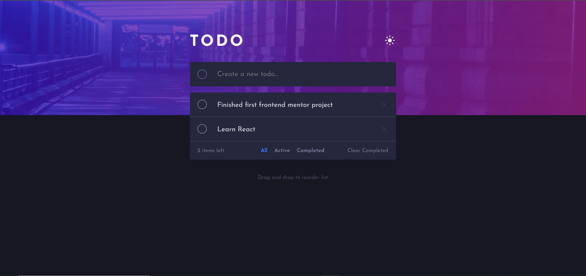

# Frontend Mentor - Todo app solution

This is a solution to the [Todo app challenge on Frontend Mentor](https://www.frontendmentor.io/challenges/todo-app-Su1_KokOW). Frontend Mentor challenges help you improve your coding skills by building realistic projects.

## Table of contents

- [Overview](#overview)
  - [The challenge](#the-challenge)
  - [Screenshot](#screenshot)
  - [Links](#links)
- [My process](#my-process)
  - [Built with](#built-with)
  - [What I learned](#what-i-learned)
  - [Continued development](#continued-development)
- [Author](#author)

## Overview

### The challenge

Users should be able to:

- View the optimal layout for the app depending on their device's screen size
- See hover states for all interactive elements on the page
- Add new todos to the list
- Mark todos as complete
- Delete todos from the list
- Filter by all/active/complete todos
- Clear all completed todos
- Toggle light and dark mode
- **Bonus**: Drag and drop to reorder items on the list
- **Bonus**: Add doubleClick to edit todo item on desktop screen

### Screenshot

### Links

- Live Site URL: [Live site of the challenge hosted here](https://todo-main-yuyang.netlify.app/)

## My process

### Built with

- Semantic HTML5 markup
- CSS custom properties
- Sass preprocessor
- Gulp for SCSS pre-processing
- Mobile-first workflow
- Typescript
- [React](https://reactjs.org/) - JS library

### What I learned

Use this Project to learn Typescript and reviewing React concepts,like Context API,Custom Hook

### Continued development

I want to continue to learn and practice project using react and typescript.

## Author

- Website - Well I haven't made my profile portfolio, gonna make it sooon when I know a lot of stuffs
- Frontend Mentor - [@JasonYang840723](https://www.frontendmentor.io/profile/JasonYang840723)
